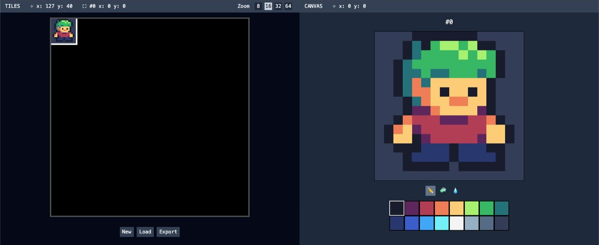
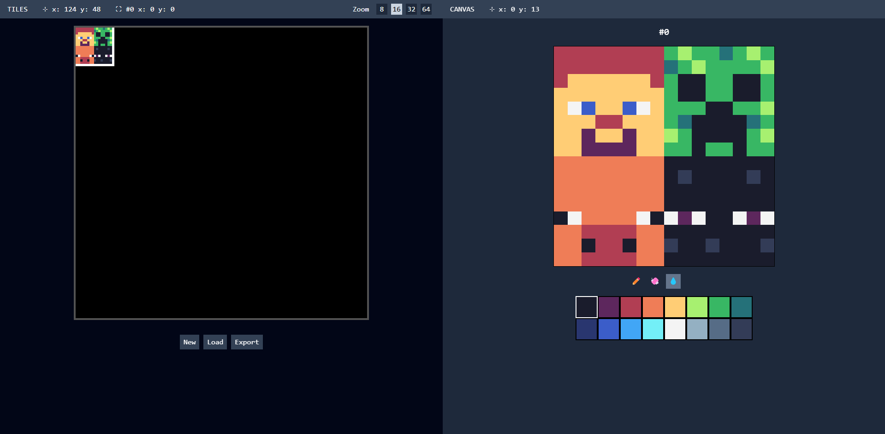

# SvPix

SvPix is a pixel art sprite editor powered by Svelte.

Working Demo: https://svpix.vercel.app/

## Overview

SvPix is a web application that allows you to create and edit pixel art sprites.

It is built using Svelte, HTML Canvas, and Tailwind CSS for styling.

## Features

- Create and edit pixel art sprite with tileset
- Export as .png file
- Load from image file
- Canvas zoom
- Tools for drawing, erasing, and filling

## Demo Video

https://github.com/user-attachments/assets/1acd26e9-8d76-492f-b5d1-826811275bae

## Screenshots

